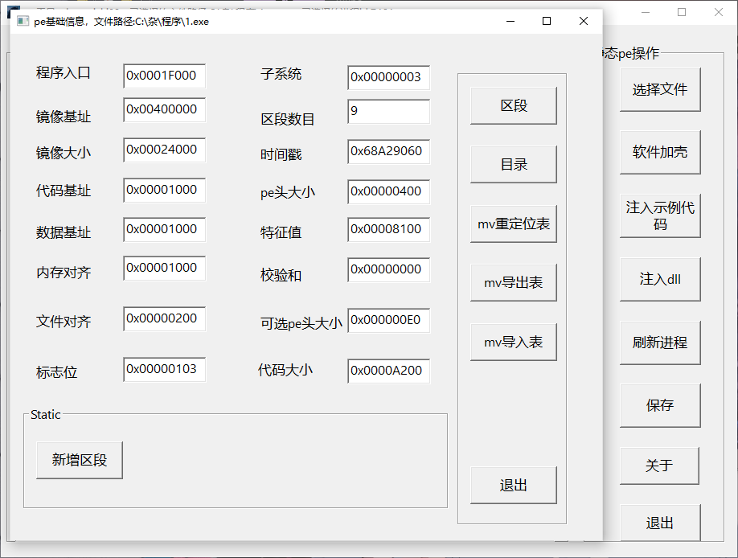

# WinPE解析操作工具（32位）V1.3.2

## 一、项目简介（滴水三期全部内容）

`WinPE解析操作工具`是一款基于**原生C/C++\**开发的轻量级32位Windows PE（Portable Executable）文件分析与操作工具，提供可视化界面与便捷操作，帮助用户快速理解PE文件结构、定位进程加载模块，并验证注入逻辑。

## 二、核心功能

工具涵盖**PE解析**、**动态进程操作**、**静态pe操作**三大模块，具体功能如下：

### 1. PE文件解析（支持32位.exe/.dll）

- **PE头信息**：显示镜像基址（Image Base）、程序入口（Entry Point）、镜像大小（Image Size）、区段数目（Number of Sections）、校验和（CheckSum）、子系统（Subsystem）等关键字段（如截图中“pe信息”窗口所示）。
- **区段**：列出所有区段（Section）的名称（如`.text`/`.data`）、起始地址、大小、属性（可读/可写/可执行），新增末尾区段
- **原始字节：**驱动器原始字节查看。
- **反汇编**：对选中的静态pe文件进行从程序入口处开始的可执行区段反汇编
- **表结构**：
  
  - 导入表（Import Table）：显示导入的DLL名称（如`kernel32.dll`）及函数列表（函数名/序数）；
  
  - 导出表（Export Table）：查看导出的函数名称、地址及序数；
  
  - 重定位表（Relocation Table）：显示重定位项的地址（如`0x00001000`）及类型（IMAGE_REL_BASED_32）。
  
  - 导入导出表重定位表移动（会移动到最后一个区段）
  

### 2. 动态进程操作

- **实时进程列表**：刷新显示系统当前运行的32位进程，包含进程名称（如`KuGou.exe`）、PID（如`4692`）、镜像基址（如`0x00570000`）、镜像大小（如`0x000E0000`）（如截图中“进程”列表所示）。
- **模块信息**：选中进程后，显示其加载的所有模块（如`ntdll.dll`、`KERNEL32.dll`）及模块位置（内存地址，如`0x77B00000`）。
- **动态dll注入：**选中进程后可动态的向当中注入dll。
- **选择jinchengshell.exe文件后进行如下操作：**
- **函数监控：**可对进程中的函数进行监控，自动保存参数在./info.txt，可取消监控（默认监控messagebox）。
- **函数调用：**调用想调用的函数，（默认调用messagebox）。
- **代码执行：**执行任意注入的代码（默认messagebox）。

### 3. 静态pe操作：

- **选择32winpe文件后进行如下操作：**
- **DLL注入**：选择目标文件，加载并注入指定的32位DLL文件（如`inject.dll`）
- **示例代码注入**：提供预定义的示例注入代码（弹出空白消息框），快速验证注入功能的正确性。
- **新增区段**：新增一个末尾区段。
- **表操作：**移动导入，导出，重定位表到最后一个区段。
- **选择壳程序：keshell.exe后进行下面操作：**
- **软件加壳：**对选中的pe文件加壳后保存为./newshell.exe
- **保存：**对修改后的pe文件进行保存。

 